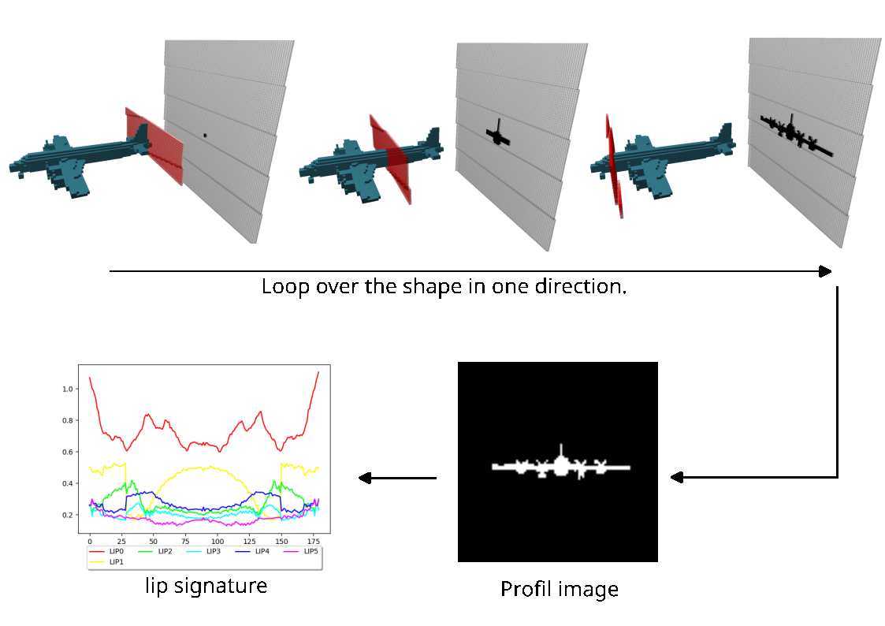

# LIP3D – Geometric Signature for 3D Shape Analysis



## What is LIP3D used for?

This repository provides code to extract compact geometric features from 3D shapes.  
The method is being published in a scientific article and extends the 2D **LIP** (Largest Intersection and Projection) descriptor introduced by Thanh Phuong in 2018 (*"Shape measurement using LIP-signature"*) to the 3D domain.

It works by:
1. Generating **2D binary profile images** of a 3D shape along its principal directions (like silhouette projections),
2. Summarizing each profile into a **compact feature vector** using LIP descriptors.

This approach enables efficient classification, analysis, and comparison of 3D shapes based on their projected geometry.

---

## How to Use This Code?

This repository provides **two main functionalities**:

### 1. Profile Image Generation (C++ with DGtal)

This part extracts silhouette-like **2D profile images** of 3D shapes using a voxelized volume and a PCA-based orientation.  
Implemented in **C++** using the [DGtal library](https://www.dgtal.org/), it provides:

- A module to traverse the 3D shape with slicing planes (orthogonal to principal directions),
- An **interactive 3D viewer** to visualize both the shape and scanning process in real time.

### 2. Feature Extraction Using LIP (Python)

The second part computes the **LIP signature** from the profile images.

- Implemented in **Python**, it computes 6 normalized features per profile.
- Includes feature alignment, circularity estimation, and Fourier-based orientation merit.
- Enables downstream tasks such as **classification**, **ablation studies**, or **descriptor visualization**.

---

## C++ Dependencies

To build the C++ components, make sure you have the following:

### Required

- **C++11-compatible compiler**
- **[DGtal](https://dgtal.org/) ≥ 1.4**  
  DGtal and DGtalTools libraries must be available and discoverable by `CMake`.

> Use the `DGtal_DIR` environment variable to specify a custom DGtal path if needed.

### Bundled (Header-only)

These are already included under the `ext/` directory:

- [CLI11](https://github.com/CLIUtils/CLI11) – command-line parser
- A lightweight CSV parser – used for feature loading

No separate installation is needed for these.

---

### C++ Build Instructions

```
mkdir build && cd build
cmake ..
make
```

### Python Dependencies

To run the Python feature extraction and classification scripts, you need the following libraries:

### Required Python Packages

| Package         | Purpose                               |
|-----------------|----------------------------------------|
| `numpy`         | Numerical array computations           |
| `pandas`        | CSV reading and tabular data handling  |
| `matplotlib`    | Plotting and visualization             |
| `scikit-image`  | Image processing and Radon transform   |
| `scikit-learn`  | Classification, metrics, GridSearch    |
| `opencv-python` | Reading and processing `.pgm` images   |
| `seaborn`       | Heatmaps and advanced plots            |
| `joblib`        | Model saving/loading                   |

### Installation

You can install them all at once:

```
pip install numpy pandas matplotlib scikit-image scikit-learn opencv-python seaborn joblib
```