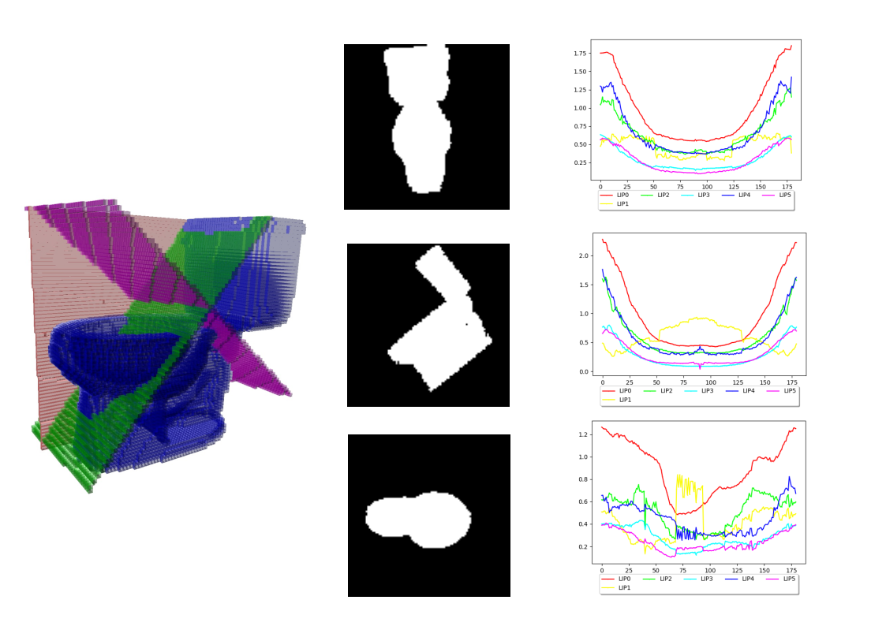
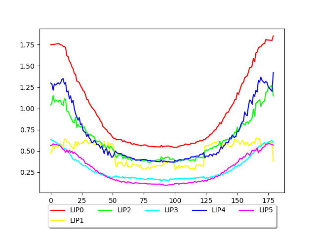
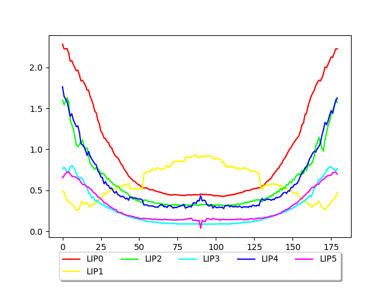
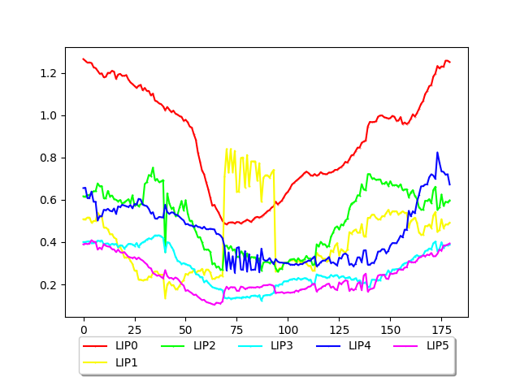

# A 3D Compact Shape Descriptor based on LIP Signature



## What is it used for?

This repository provides code to extract compact geometric features from 3D shapes.  
The method is being published in a scientific article and extends the 2D **LIP** (Largest Intersection and Projection) descriptor introduced by Thanh Phuong in 2018 (*"Shape measurement using LIP-signature"*) to the 3D domain.

It works by:markdown
1. Generating **2D binary profile images** of a 3D shape along its principal directions (like silhouette projections),
2. Summarizing each profile into a **compact feature vector** using LIP descriptors.

This approach enables efficient classification, analysis, and comparison of 3D shapes based on their projected geometry.

---

## How to Use This Code?

This repository provides **two main functionalities**:

### 1. Profile Image Generation (C++ with DGtal)

This part extracts silhouette-like **2D profile images** of 3D shapes using a voxelized volume and a PCA-based orientation.  
Implemented in **C++** using the [DGtal library](https://www.dgtal.org/), it provides:

- A module to traverse the 3D shape with slicing planes (orthogonal to principal directions),
- An **interactive 3D viewer** to visualize both the shape and scanning process in real time.

### 2. Feature Extraction Using LIP (Python)

The second part computes the **LIP signature** from the profile images.

- Implemented in **Python**, it computes 6 normalized features per profile.
- Includes feature alignment, circularity estimation, and Fourier-based orientation merit.
- Enables downstream tasks such as **classification**, **ablation studies**, or **descriptor visualization**.

---

## C++ Dependencies

To build the C++ components, make sure you have the following:

### Required

- **C++11-compatible compiler**
- **[DGtal](https://dgtal.org/) ≥ 1.4**  
  DGtal and DGtalTools libraries must be available and discoverable by `CMake`.

> Use the `DGtal_DIR` environment variable to specify a custom DGtal path if needed.

### Bundled (Header-only)

These are already included under the `ext/` directory:

- [CLI11](https://github.com/CLIUtils/CLI11) – command-line parser
- A lightweight CSV parser – used for feature loading

No separate installation is needed for these.

---

### C++ Build Instructions

```
mkdir build && cd build
cmake ..
make
```

### Example: Generating Profile Images with `imProfile`

The `imProfile` binary is used to extract 2D profile images (binary silhouettes) from a 3D voxelized shape by slicing it along its principal directions.

#### Inputs
- A 3D mesh file in `.off` format
- Required parameters:
  - `--input <path>`: path to the input `.off` mesh
  - `--output <dir>`: output directory for generated `.pgm` images
  - `--res <int>`: voxel grid resolution (e.g., 200)
  - `--maxScan <int>`: number of slicing planes across the object (e.g., 100)
  - `--imageSize <int>`: size of the output 2D images in pixels (e.g., 200)
- Optional:
  - `--viewer`: enable interactive 3D viewer during slicing

#### Usage

```
./imProfile \
  --input examples/toilet_0046.off \
  --output results/toilet_0046/ \
  --res 200 \
  --maxScan 100 \
  --imageSize 200
```
#### Output

This will generate: `toilet_0046_m.pgm`, `toilet_0046_s.pgm`, `toilet_0046_t.pgm`: silhouettes from the three principal directions 
Located in the specified output directory

<div style="display: flex; justify-content: space-around;">
  
  
  
</div>

## Python Dependencies

To run the Python feature extraction and classification scripts, you need the following libraries:

### Required Python Packages

| Package         | Purpose                               |
|-----------------|----------------------------------------|
| `numpy`         | Numerical array computations           |
| `pandas`        | CSV reading and tabular data handling  |
| `matplotlib`    | Plotting and visualization             |
| `scikit-image`  | Image processing and Radon transform   |
| `scikit-learn`  | Classification, metrics, GridSearch    |
| `opencv-python` | Reading and processing `.pgm` images   |
| `seaborn`       | Heatmaps and advanced plots            |
| `joblib`        | Model saving/loading                   |

### Installation

You can install them all at once:

```
pip install numpy pandas matplotlib scikit-image scikit-learn opencv-python seaborn joblib
```


### Example: Extracting LIP Features from Profile Images `lip_sign.py`

The script `lip_sign.py` computes **LIP descriptors** from three input 2D profile images (typically generated with `imProfile`). It processes each image using the Radon transform and extracts six LIP signatures per image.

#### Inputs
- Three 2D profile images (in `.pgm` or `.png` format), corresponding to the main directions: M (main), S (secondary), T (tertiary)
- An output directory where `.csv` and `.png` results will be saved

#### Usage

```
python lip_sign.py \
  toilet_0046_m.pgm toilet_0046_s.pgm toilet_0046_t.pgm \
  ./results/toilet_0046/
```

#### Output

This will generate:

- Three CSV files:
  - toilet_0046_m.csv, toilet_0046_s.csv, toilet_0046_t.csv
  Each contains six LIP signatures (LIP0 to LIP5) across 180 angles.

- Three visualization plots:

  - toilet_0046_m_visu.png, toilet_0046_s_visu.png, toilet_0046_t_visu.png
  These show all six signature curves per image.

<div style="display: flex; justify-content: space-around;">
  
  
  
</div>


These CSV files serve as input for the next step: local feature extraction and classification.

### Example: Building a compact Feature Vector from LIP Signatures `make_custom_feature_file.py`

This script aggregates the LIP signatures previously extracted by `lip_sign.py` and creates a final compact feature vector for classification. It also offers optional geometric descriptors such as **circularity** and **orientation merit**.

#### Inputs
- Three `.csv` files containing LIP signatures for a single object:
  - `*_m.csv`, `*_s.csv`, `*_t.csv`
- The corresponding 2D profile images:
  - `*_m.pgm`, `*_s.pgm`, `*_t.pgm`
- Optional flags to include:
  - `--use_circularity` — computes the circularity of each image
  - `--use_orientation_merit` — computes orientation-based discriminative power

#### Usage

```
python make_custom_feature_file.py \
  toilet_0046_m.csv toilet_0046_s.csv toilet_0046_t.csv \
  toilet_0046_m.pgm toilet_0046_s.pgm toilet_0046_t.pgm \
  --use_circularity --use_orientation_merit
```
#### Output
The script prints to standard output the final feature vector composed of:

  - 3 × 3 local statistics (max, min, median) on each signature 3 views × 6 signatures = 18 values

  - (Optional) 3 circularity values

  - (Optional) 3 orientation merit values

Redirect the output to a .txt file for batch processing:

```
python make_custom_feature_file.py ... > toilet_features.txt
```